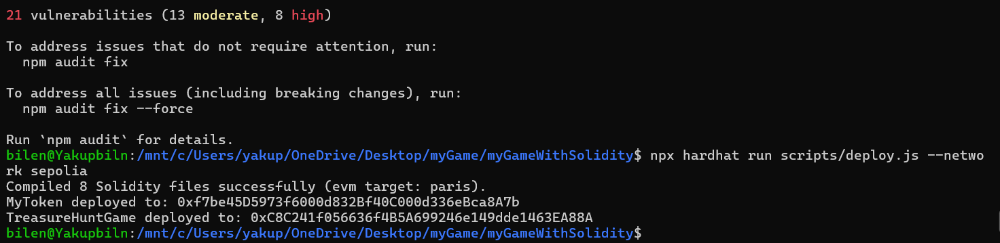

# TreasureHuntGame Smart Contract

## Overview

The `TreasureHuntGame` smart contract is a blockchain-based treasure hunt game implemented in Solidity. Players can join the game, move around a grid, and find treasures and support packages. The game uses a custom ERC-20 token for in-game transactions such as buying clues.

## Features

- **Grid-Based Movement:** Players navigate a 32x32 grid to find treasures and support packages.
- **Token Integration:** Utilizes a custom ERC-20 token for transactions and rewards.
- **Clue System:** Players can buy clues to help find treasures.
- **Game Management:** Allows players to join the game, move, and check their status.
- **Game Status:** Provides current status of the game and determines the winner based on steps taken.

## Contract Address

The contract interacts with a custom ERC-20 token. Ensure that you provide the correct token address during deployment.

## Functions

### `joinGame()`

- Allows a player to join the game.
- Requires that the player has not joined before and the game is not full.

### `startGame()`

- Starts the game if it has not been started yet.

### `movePlayer(string memory _direction)`

- Moves the player in the specified direction (`"up"`, `"down"`, `"left"`, `"right"`).
- Updates the player's position and checks for treasure or support packages.

### `buyClue()`

- Allows a player to buy a clue by transferring tokens to the game contract.
- Only callable during the game.

### `getClue()`

- Provides a clue to the player if they have purchased one.
- The logic for providing clues should be implemented.

### `findSupportPackage()`

- Checks if the player is on a block with a support package.

### `findTreasure()`

- Checks if the player has found a treasure and rewards them with tokens.
- Ends the game for the player who finds the treasure.

### `getGameStatus()`

- Returns the current status of the game: not started, in progress, or over.

### `winnerAddress()`

- Determines and returns the address of the current winner based on the number of steps taken.

## Modifiers

- **`JoinedGame`**: Ensures the player has not joined the game already.
- **`onlyDuringGame`**: Ensures the function is called during an active game.
- **`onlyPlayer`**: Ensures the function is called by a player who has joined the game.

## Constructor

```solidity
constructor(address _tokenAddress, uint256 _clueCost, uint256 _supportPackageBlocks, uint256 _gameDuration)
```

### Compile and Deploy Smart Contracts

Compile the smart contracts by running the following command:

```sh
npx hardhat compile
```

deploy Sepolia
```sh
npx hardhat run scripts/deploy.js --network sepolia
```

console hardhat
```sh
npx hardhat console  --network sepolia
```


