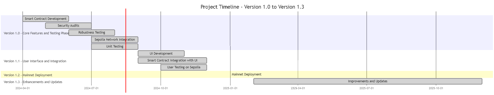
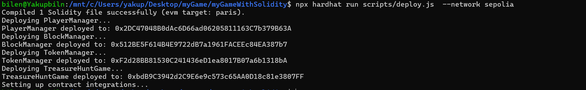

# 🏴‍☠️ TreasureHuntGame 🏴‍☠️

## 🌟 Game Concept

**TreasureHuntGame** is a thrilling **decentralized, blockchain-based** treasure hunting adventure where players compete to find hidden treasures within a vast, mysterious virtual world. The game leverages **smart contracts** to manage player movements, block interactions, and token transactions, ensuring **transparency, fairness,** and **security**.

Each player navigates the virtual world, using **clues** and **strategies** to locate the treasure before others. The game is **time-bound**, adding a layer of **excitement** and **urgency**.

---

## 🚀 Key Features

- **🛡️ Decentralization:** The game operates on the blockchain, eliminating the need for a central authority and ensuring security and transparency.

- **⚔️ Competitive Play:** Players compete to be the first to uncover the hidden treasure. Movement and actions are tracked on the blockchain, ensuring fair play.

- **⏳ Time-Limited:** The game is designed with a specific duration of 15 minutes. Once this time is up, the game ends automatically, and no further moves can be made. The elapsed time is tracked to determine when the game has ended.

- **📜 Player Actions:** Players can join or leave the game, move around the game world, and claim any discovered treasures. The game also includes mechanisms to check support packages and treasures, though there are no in-game clues or purchases.

---

## 🎮 How to Play

### Treasure Hunt


---
## 🎮 How to Play

### 1. Joining the Game
Players can join the game by calling the `joinGame` function. Ensure that you are the sender of the transaction to join.

### 2. Starting the Game
The game starts when an authorized address calls the `startGame` function. The game can only be started once.

### 3. Player Movement
Navigate the game world using the `movePlayer` function. Ensure that you are a player and that the game is ongoing.

### 4. Claiming Support Packages
To claim support packages, call the `claimSupportPackage` function if you have a support package available.

### 5. Claiming Treasure
To claim the treasure, use the `claimTreasure` function if you have found the treasure in the game.

### 6. Checking Game State
- **Check Support Package:** Use the `checkSupportPackage` function to determine if you have a support package available.
- **Check Treasure:** Use the `checkTreasure` function to determine if you have found the treasure.

### 7. Viewing Player Information
- **Verify Player Status:** Use the `isPlayer` function to check if an address is a player and get their status.
- **List of Players:** Use the `ShowPlayers` function to see a list of all players.
- **Find Player Coordinates:** Use the `findPlayer` function to get the current coordinates of a player.

### 8. Leaving the Game
If you want to leave the game, call the `leaveGame` function. Ensure that you are the player leaving the game.

---

## Additional Information
- **Game Duration:** The game lasts for 15 minutes from the time it is started.The game automatically ends after 15 minutes.
- **Authorization:** Only the authorized address can start or finish the game.
- **Modifiers:** Functions are protected by modifiers to ensure that only the appropriate addresses can call them under the correct conditions.

---

## 🗺️ Roadmap

Every step we take together paves a secure and steady path to the mainnet. We’re moving forward with confidence, feeling the success close at hand.



---

## 🚀 Compile and Deploy Smart Contracts

### Project Setup

To ensure the project runs correctly, you need to create a `.env` file with the following information:

This file should contain your private key and Infura project ID. Make sure to replace `your_private_key_here` and `your_infura_project_id_here` with your actual values.

### Cloning the Project Repository:
```bash
git clone https://github.com/etherbiln/myGame-Solidity.git
cd myGame-Solidity

```
### Test:

```sh
npx hardhat test
```

### Deploy Sepolia

```sh
npx hardhat run scripts/deploy.js --network sepolia
```
---


